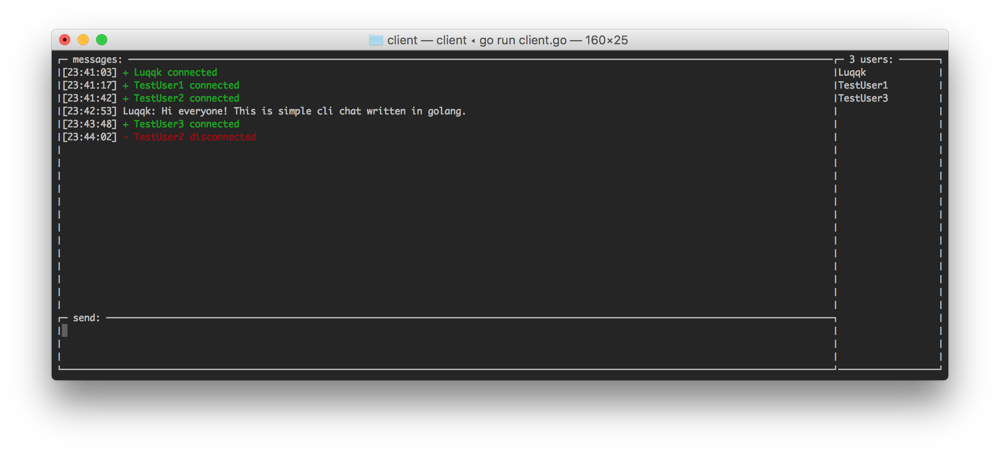

[](https://goreportcard.com/report/github.com/Luqqk/go-cli-chat)

## 💬 go-cli-chat

Chat server and client written in Go (simple prototype for learning purposes). The application heavily utilizes goroutines and channels. Go makes the concurrency easy to use and I had a lot of fun during development of this simple app.



### Usage

```bash
$ go get github.com/Luqqk/go-cli-chat/...
```

Now you can run server and client:

```bash
$ $GOPATH/bin/chat-server
```

```bash
$ $GOPATH/bin/chat-client
```

You can also use `make` commands:

Build and run `chat-server`:

```bash
$ make run-server
```

Build and run `chat-client`:

```bash
$ make run-client
```

Build `chat-server`, `chat-client` and put binaries into corresponding `cmd/*` dir:

```bash
$ make build
```

Install `chat-server`, `chat-client` and put binaries into `$GOPATH/bin/` dir:

```bash
$ make install
```
